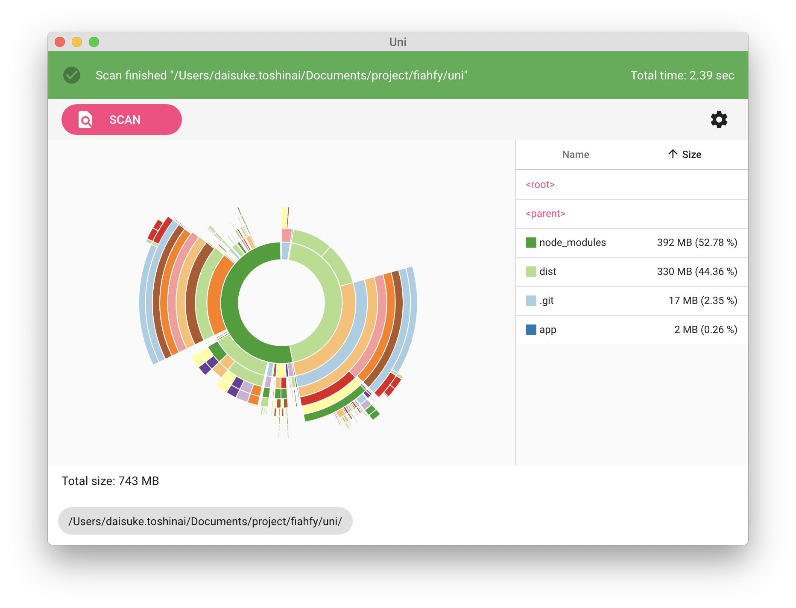

# Uni


> Simple Disk Usage Analyzer based on Electron.  
> "Uni" means sea urchin in Japanese.  
> Inspired from [Space Radar Electron](https://github.com/zz85/space-radar).  
> Icons made by [Freepik](https://www.flaticon.com/authors/freepik) from [www.flaticon.com](https://www.flaticon.com/)

## Features

- Pie chart graph view
- Change theme (Light/Dark)

## Screenshots



## Installation

Download the app from [release page](https://github.com/fiahfy/picky/releases) and install it.  
:warning: For macOS, this app is not signed, so a warning will be displayed at startup.

## Development

```bash
# install dependencies
yarn

# serve with hot reload
yarn dev
```
